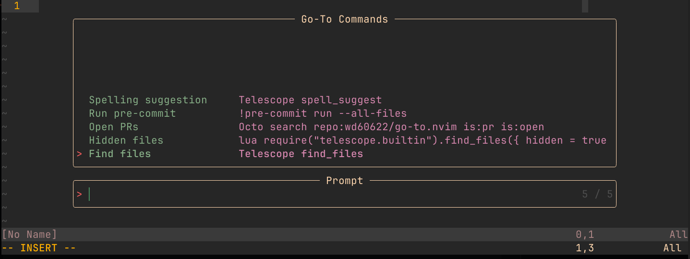

# go-to.nvim

Store your go-to commands and access them with fuzzy search.



## Installation

Install with your favorite plugin manager. For example, with [lazy.nvim](https://github.com/folke/lazy.nvim):

```lua
{
    "wd60622/go-to.nvim",
    dependencies = { 
      "nvim-telescope/telescope.nvim",
      -- Optional 
      -- "rcarriga/nvim-notify",
    },
    opts = {
        display_only = false,
        confirm_delete = true,
        sort_by = "recency", -- "frequency", "alphabetical", "recency", or callable
    },
}
```

## Usage

### Available Commands

The plugin provides the following commands:

| Command | Description |
| --- | --- |
| `AddCommand` | Add a new command to the list. |
| `ShowCommands` | Show all commands in the list. |
| `DeleteCommand` | Delete a command from the list. |
| `EditCommands` | Edit the commands in their file format. |

Each set of commands are project specific.

### Available Mappings

| Location | Key | Description | 
| --- | --- | --- |
| command mode | `<C-s>` | Save off the current command | 
| picker | `<C-d>` | Delete the current command | 
| picker | `<C-e>` | Edit the current command | 
| picker | `<C-m>` | Modify the current command | 
